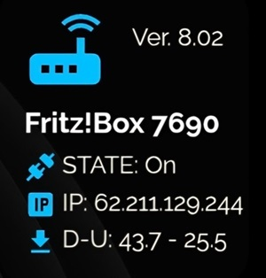
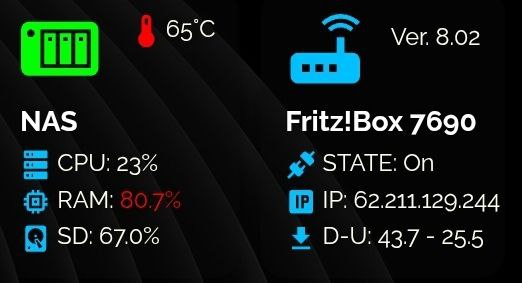
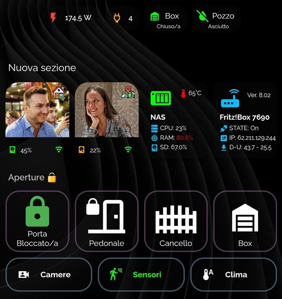

<h2><strong>🛜 Fritz!box Info</strong></h2>

CARD per mostrare informazioni del nostro Fritz!box

Volevo condividere una scheda che ho creato con l'aiuto delle varie community per visualizzare le informazioni di una persona tramite l'utilizzo dell'app HA companion.

Istruzioni:

da Hacs, installare:
1. button-card

poi ...
1. nel file sensor.yaml, inserire il contenuto di sensor.yaml, se non si dispone del file:
    - è necessario creare sensor.yaml nella cartella config/
    - aprire il file configuration.yaml e inserire questa riga: sensor: !include sensor.yaml
2. in HA create una card manuale e incollate il contenuto del file: card.yaml
3. all'interno del codice della card e del codice inserito nel sensor.yaml, dovete andare a sostituire tutti i sensori del mio fritz con quelli del vostro fritz (solitamente cambia il numero e basta).

<strong>Alla fine ci troveremo ad avere questo risultato finale:</strong> 

Enjoy!

---

## ☕ Vuoi darmi una mano?

Il contenuto di questa pagina è completamente gratuito e lo scopo non è certamente fare soldi. Se vuoi darmi una mano per le spese e il tempo perso, ecco alcuni modi:

| | |
|---|---|
|  | Offrimi un caffè su Ko-fi |
|  | Una donazione libera su PayPal |
|  | Fai i tuoi acquisti Amazon partendo da questo link |

**Canali Telegram:**

| | |
|---|---|
|  | Notizie dedicate a Home Assistant |
|  | Offerte sui prodotti di domotica |

---

Sviluppato e curato da [Simonz82](https://t.me/Simonz82) · © 2026
